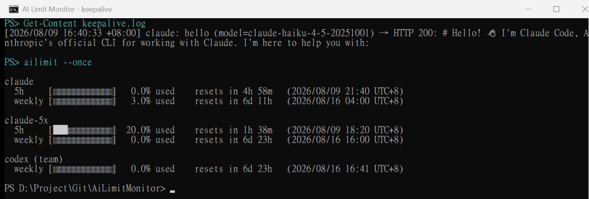
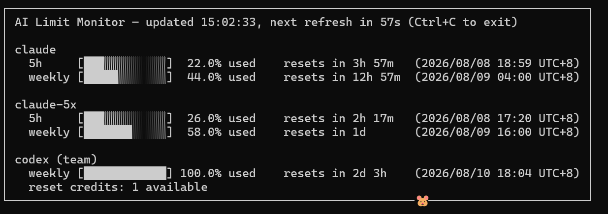
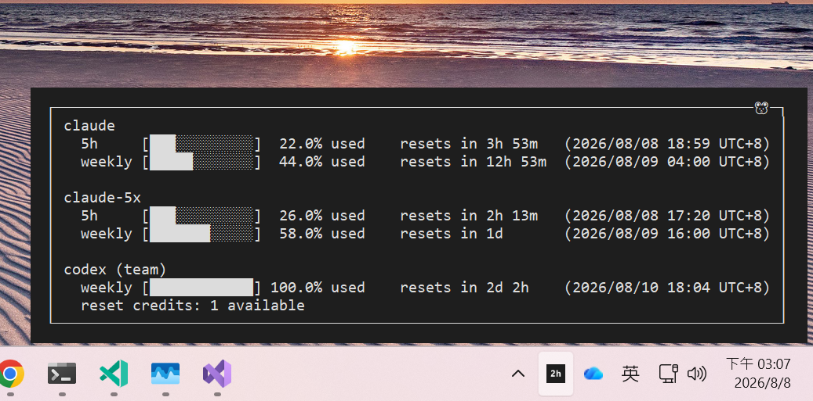
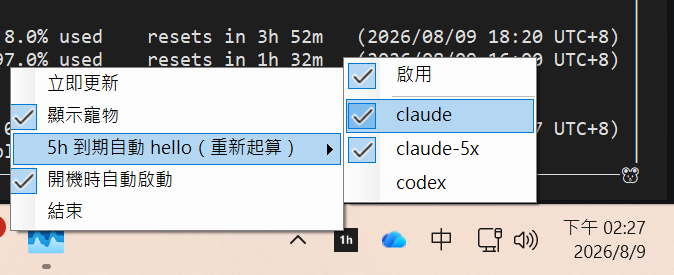

# AI Limit Monitor

隨時掌握 Claude Code 與 Codex CLI 還剩多少額度的小工具（目前版本 1.3.0），有兩種用法：

- **終端機版**：開一個視窗持續顯示各帳號的剩餘額度
- **桌面版**：縮在螢幕右下角時鐘旁邊的小圖示，滑鼠移上去就能看，不佔位置

## 功能亮點

### 額度計時自動重啟（桌面版）

Claude 的「5 小時額度」有個特性：**從你送出第一句話才開始倒數**。如果額度期滿時你人不在電腦前（半夜、外出），沒有人說話、新的 5 小時就不會開始跑，等你回來才起算，等於白白浪費一段可用時間。

在右下角圖示按右鍵 → **「5h 到期自動 hello（重新起算）」** → 勾選「啟用」，程式就會自動幫你顧著：

- 發現某個帳號的 5 小時額度已期滿、而且完全沒人在用（使用率 0%），就自動送出一句 `hello`，讓新的 5 小時立刻開始倒數
- 期滿但看得出有人在用（使用率大於 0%）就不打擾，只在紀錄檔寫下當時的使用率，讓你知道「為什麼這次沒有呼叫」
- 想讓哪些帳號自動 hello 可以逐一勾選，預設只勾 Claude；像 codex team 這種只有每週額度、沒有 5 小時限制的方案，永遠不會被呼叫
- 可設定允許呼叫的星期與多個時間區間，例如平日 `09:00～18:00`、`20:00～21:30`；區間外仍會正常監控使用量，但不會送出 hello
- 每次呼叫（或略過）都會寫進 `ailimit-tray.exe` 所在資料夾的 `keepalive.log`，一行一筆：時間、帳號、送了什麼（含使用的 AI 模型）、對方回了什麼，成功失敗都看得到
- 真的送出去的呼叫還會記下**這次花了多少 token**，以及該帳號**至今累計花掉多少**（重開程式也會從紀錄檔接續，不會歸零）：

  ```text
  [2026/08/11 20:20:22 +08:00] claude: Hello，請不要有任何回應 (model=claude-haiku-4-5-20251001) → HTTP 200: 我理解了。 [tokens in=28 out=12 total=40 | 累計 in=196 out=84 total=280]
  ```

  累計數字也直接顯示在右鍵選單的帳號勾選項後面，不用翻紀錄檔就看得到
- 所有勾選都會記住，下次開啟不用重設；同一帳號 10 分鐘內不會重複呼叫
- 任一額度已用滿 100%（例如每週額度用完）時自動暫停，不做白工

> 提醒：這個功能會真的送出一句話，所以**會用掉極少量額度**（Claude 用最便宜的 Haiku 模型、Codex 用 mini 級模型）；沒勾選「啟用」時，程式只讀資料、零消耗。
> 想更換呼叫的模型或直接編輯設定檔，請參考下方開發者說明的[自動保活參數](#自動保活參數)章節。

實際運作證明——上半部是 `keepalive.log`：16:40 額度一期滿就自動送出 hello（含使用的模型）並得到 HTTP 200；下半部是當下的額度狀態：claude 的 5 小時計時已歸零重新開始（0.0%、於 21:40 重置 = 16:40 送出 + 5 小時）：



## 快速上手（免安裝）

不需要安裝任何東西，下載解壓縮就能用（Windows x64）：

1. 到 [Releases](https://github.com/lawrence8358/AiLimitMonitor/releases) 下載其中一個（或兩個都要）：
   - **`console.zip`** — 終端機版
   - **`desktop.zip`** — 桌面版
2. 解壓縮到任意資料夾
3. 執行：
   - 終端機版：開啟終端機（PowerShell 或命令提示字元）執行 `ailimit.exe`，畫面會自動更新（按 `Ctrl+C` 離開；`ailimit.exe --once` 則查一次就結束）
   - 桌面版：直接雙擊 `ailimit-tray.exe`，右下角會出現一個小圖示，上面的數字是「距離下次額度重置還有多久」；滑鼠移上去看完整資訊，按右鍵開選單或離開
4. 第一次執行會自動找到電腦上已登入的 Claude Code（多個帳號也抓得到）與 Codex CLI，不需要手動設定；之後想增減帳號，再編輯 `%USERPROFILE%\.ailimitmonitor\config.json` 即可

> 前提：電腦上要已經登入過 `claude` / `codex`（工具借用它們的登入資訊來查額度，平常只讀取、不消耗任何額度）。
> 若 Windows SmartScreen 跳出警告，點「其他資訊 → 仍要執行」即可。

**終端機版**



**桌面版（滑鼠移到右下角圖示上）**



### 桌面版功能一覽

- **剩餘時間一目瞭然**：右下角圖示上的數字就是「距離下次額度重置還有多久」（`3h`＝約 3 小時、`58m`＝約 58 分鐘、`2d`＝約 2 天）
- **滑鼠移上去（或左鍵點一下）**：彈出完整額度資訊，內容與終端機版相同
- **Codex 重置卷到期日**：有可用重置卷時，終端機版與桌面版彈窗都會顯示每張卷的到期倒數與本機日期；沒有到期日的卷則標示為不會到期
- **右鍵選單**：
  - `立即更新` — 馬上重新查詢一次
  - `顯示寵物` — 開關資訊視窗邊框上跑來跑去的小寵物 🐹
  - `5h 到期自動 hello（重新起算）` — 額度計時自動重啟（詳見上方功能亮點），可逐帳號勾選，並設定允許呼叫的星期與時段
  - `開機時自動啟動` — 登入 Windows 後自動執行
  - `結束` — 關閉程式
- **只會有一個圖示**：已經在執行時再點一次執行檔（或開機自動啟動與手動開啟撞在一起），不會多開一個，而是提示你圖示的位置並彈出額度資訊




---

## 開發者說明

以下內容供開發者參考，一般使用者可以略過。本專案以 .NET 10 開發，兩種介面共用同一套核心邏輯（`AiLimitMonitor.Core`）。

```
claude
  5h     [██████░░░░░░]  50.0% used    resets in 3h42m    (Sat 04:40 UTC+8)
  weekly [█████░░░░░░░]  42.0% used    resets in 27h02m   (Sun 04:00 UTC+8)

codex (team)
  weekly [███████████░]  91.0% used    resets in 65h06m   (Mon 18:04 UTC+8)
  reset credits: 1 available           expires in 21d 3h   (2026/09/17 08:00 UTC+8)
```

### 專案結構

| 專案 | 說明 |
|---|---|
| `src/AiLimitMonitor.Core` | 共用邏輯：providers、設定檔、文字渲染 |
| `src/AiLimitMonitor.Cli` | 終端機版（`ailimit`），持續刷新畫面 |
| `src/AiLimitMonitor.Tray` | 桌面版（`ailimit-tray`），常駐系統匣（通知區）圖示顯示距離下次重置的時間，滑鼠移過去彈出與終端機版相同的資訊視窗 |
| `tests/AiLimitMonitor.Core.Tests` | 單元測試（xUnit） |

### 使用方式

```powershell
# 終端機版：持續監控（Ctrl+C 離開）
dotnet run --project src/AiLimitMonitor.Cli

# 只查詢一次
dotnet run --project src/AiLimitMonitor.Cli -- --once

# 自訂刷新間隔（秒）／設定檔路徑／關閉邊框小寵物
dotnet run --project src/AiLimitMonitor.Cli -- --interval 30 --config C:\path\config.json --no-pet

# 桌面版
dotnet run --project src/AiLimitMonitor.Tray
```

桌面版操作：圖示上的文字為**距離所有帳號中最近一次重置的剩餘時間**（如 `3h` = 最快到期的視窗約 3 小時後重置，`58m`、`2d` 同理）；滑過或左鍵點擊顯示完整資訊；右鍵選單功能見上方「桌面版功能一覽」。

時間格式：超過一天顯示 `2d 3h`、一小時以上顯示 `4h 42m`、不足一小時顯示 `45m`（不足該單位就不顯示該單位）；額度重置與重置卷到期時間都以台灣慣用格式顯示，如 `(2026/08/08 18:59 UTC+8)`。

邊框小寵物 🐹：預設沿邊框順時針跑；CLI 用 `--no-pet`、Tray 用選單「Show pet」關閉。關閉時**邊框仍保留**（只移除寵物），畫面不會跳動。

### 設定檔

第一次執行會自動掃描並產生 `%USERPROFILE%\.ailimitmonitor\config.json`：

- 家目錄下所有含 `.credentials.json` 的 `.claude*` 目錄 → 各自成為一個 claude provider（多帳號如 `~/.claude-5x` 會自動加入）
- `~/.codex/auth.json` → codex provider

```json
{
  "refreshSeconds": 60,
  "providers": [
    { "type": "claude", "name": "claude",    "configDir": "~/.claude" },
    { "type": "claude", "name": "claude-5x", "configDir": "~/.claude-5x" },
    { "type": "codex",  "name": "codex",     "authPath": "~/.codex/auth.json" },
    { "type": "command", "name": "my-custom", "command": "my-usage-command" }
  ]
}
```

#### 自訂命令 provider（type: `command`)

`command` 會透過 PowerShell 執行，stdout 需輸出以下格式的 JSON，即可顯示在同一個畫面：

```json
{
  "windows": [
    { "label": "5h",     "usedPercent": 51.0, "resetsAt": "2026-08-08T00:10:00+08:00" },
    { "label": "weekly", "usedPercent": 54.0, "resetsInSeconds": 25440 }
  ],
  "notes": ["額外顯示的文字（可省略）"]
}
```

`resetsAt`（ISO 8601）與 `resetsInSeconds` 擇一即可，都省略則不顯示重置時間。

#### 自動保活參數

桌面版右鍵選單的勾選其實都存在設定檔裡，也可以直接手動編輯（改完重啟桌面版生效）：

```json
{
  "refreshSeconds": 60,
  "keepAliveEnabled": true,
  "keepAliveSchedule": {
    "rules": [
      {
        "days": ["Monday", "Tuesday", "Wednesday", "Thursday", "Friday"],
        "start": "09:00",
        "end": "18:00"
      },
      {
        "days": ["Monday", "Tuesday", "Wednesday", "Thursday", "Friday"],
        "start": "20:00",
        "end": "21:30"
      }
    ]
  },
  "providers": [
    { "type": "claude", "name": "claude", "configDir": "~/.claude",
      "keepAlive": true, "keepAliveModel": "claude-haiku-4-5-20251001" },
    { "type": "codex", "name": "codex", "authPath": "~/.codex/auth.json",
      "keepAlive": false, "keepAliveModel": "gpt-5.4-mini" }
  ]
}
```

| 欄位 | 位置 | 預設值 | 說明 |
|---|---|---|---|
| `keepAliveEnabled` | 根層級 | `false` | 總開關，等同右鍵選單的「啟用」 |
| `keepAliveSchedule` | 根層級 | 不限時段 | 全部帳號共用的允許呼叫時段；省略或設為 `null` 代表全天允許。桌面版可由「允許呼叫時段」開啟設定視窗 |
| `keepAliveSchedule.rules[].days` | 排程規則 | — | 規則適用的星期，可複選；跨日時代表區間開始的星期 |
| `keepAliveSchedule.rules[].start` / `end` | 排程規則 | — | 本機時間的 `HH:mm`。開始時間包含、結束時間不包含；結束早於開始代表跨日，例如星期五 `22:00～02:00` 會延續至星期六凌晨 |
| `keepAlive` | provider | claude 為 `true`、其他為 `false` | 該帳號是否參與自動 hello，等同子選單的帳號勾選；省略時採用預設值 |
| `keepAliveModel` | provider | claude：`claude-haiku-4-5-20251001`<br>codex：`gpt-5.4-mini` | 送 hello 時使用的模型，預設挑最便宜的。日後模型更名導致呼叫失敗時（`keepalive.log` 的回應欄看得到錯誤），改這個欄位即可，不用等程式更新。codex 只能填 ChatGPT 帳號可用的 Codex 模型代號（可參考 `~/.codex/models_cache.json` 的 `slug` 清單） |

多條排程規則採 OR 判斷，符合任一條就允許呼叫。時間依 Windows 本機時區判斷；這項限制只控制 hello，使用量查詢仍依 `refreshSeconds` 持續執行，因此進入允許區間後會在下一次刷新時判斷，而不是保證整點立刻呼叫。

實作細節：Claude 的 hello 走 `POST https://api.anthropic.com/v1/messages`（OAuth token、`max_tokens: 16`，不能帶 `anthropic-beta: oauth-2021-10-01`，usage 端點則相反）；Codex 走 Codex CLI 的 `POST https://chatgpt.com/backend-api/codex/responses`（SSE、low reasoning）。觸發判斷（允許時段、0% 才呼叫、100% 暫停、10 分鐘冷卻）在 `src/AiLimitMonitor.Core/KeepAliveService.cs`，紀錄檔固定寫在執行檔所在目錄的 `keepalive.log`。

### 資料來源

兩者皆為唯讀 API，不消耗任何額度：

- Claude：`GET https://api.anthropic.com/api/oauth/usage`（token 讀自 config 目錄的 `.credentials.json`）
- Codex：`GET https://chatgpt.com/backend-api/wham/usage`（token 讀自 `~/.codex/auth.json`）；有可用重置卷時，再以相同憑證讀取 `GET https://chatgpt.com/backend-api/wham/rate-limit-reset-credits` 取得每張卷的到期日

Codex 重置卷明細是附加資訊；若明細端點暫時無法使用，CLI 與 Tray 仍會正常顯示額度和可用卷數，只暫時省略到期日。

Claude 的 access token 過期時會自動用 refresh token 換新並寫回 `.credentials.json`（與 Claude Code 本身的行為一致），不需要手動介入；只有 refresh token 也失效時才需要開 `claude` 重新登入。Codex 的 token 由 Codex CLI 維護，若過期出現 401 請開一次 `codex`。

### 測試

```powershell
dotnet test
```

### 打包 Release

```powershell
.\build.ps1              # 跑測試 → 發佈 → 產出 dist\console.zip 與 dist\desktop.zip
.\build.ps1 -SkipTests   # 略過測試
```

兩個 zip 都是自包含（self-contained）單一執行檔，使用者不需安裝 .NET Runtime。終端機版有開啟 trimming（約 6–7 MB）；桌面版因 WinForms 不支援 trimming，約 44 MB。打包前請先關閉執行中的 `ailimit-tray`，避免檔案被鎖定。
